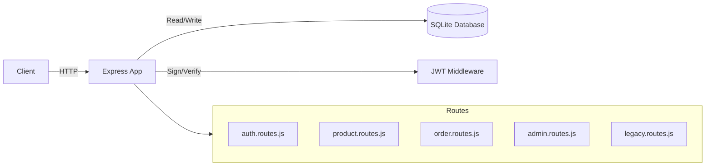

# SecureShop

SecureShop is an intentionally vulnerable E-commerce API built to demonstrate product security engineering practices, including SAST, SCA, DAST, and secure design patterns.

It is designed to be used as a portfolio project for Product Security Engineers to showcase threat modeling, vulnerability detection, and remediation skills.

## Features

- **JWT Authentication**: Real token-based authentication with `httpOnly` cookies.
- **Role-Based Access Control (RBAC)**: Distinct `user` and `admin` roles protecting sensitive endpoints.
- **Input Validation**: Strict schema validation using `joi` for all incoming data.
- **SQLite Database**: Relational database with proper foreign key constraints and transactional integrity.
- **Intentional Vulnerabilities**: Specific endpoints containing common flaws (Command Injection, SSRF) for testing security tooling.

## Security Tooling Integrations

This repository is configured to work with:
- **Semgrep (SAST)**: Custom rules located in `.semgrep/` for finding complex taint flows.
- **Trivy (SCA)**: Supply chain scanning with a custom policy engine (`scripts/trivy-policies.py`).
- **OWASP ZAP (DAST)**: Automated dynamic scanning configured via GitHub Actions.

## Architecture



## Getting Started

### Prerequisites

- Node.js 20+
- npm

### Installation

1. Clone the repository and install dependencies:
   ```bash
   npm install
   ```

2. Setup environment variables:
   ```bash
   cp .env.example .env
   ```

3. Seed the database with initial data:
   ```bash
   npm run seed
   ```

4. Start the development server:
   ```bash
   npm run dev
   ```

The API will be available at `http://localhost:3000`.

### Default Credentials

After running `npm run seed`, the following users are available:
- Admin: `admin@secureshop.local` / `admin123`
- User: `alice@example.com` / `user123`

## Project Structure

- `src/server.js`: Main application entry point
- `src/routes/`: API endpoint definitions separated by domain
- `src/middleware/`: Security and validation middleware (auth, RBAC, input validation)
- `src/db/`: Database configuration and seeding scripts
- `src/config/`: Centralized environment configuration
