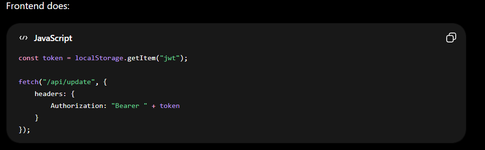
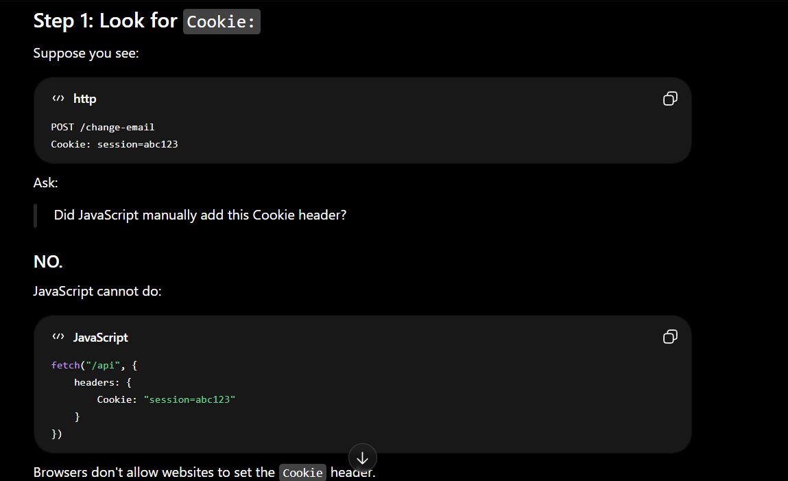
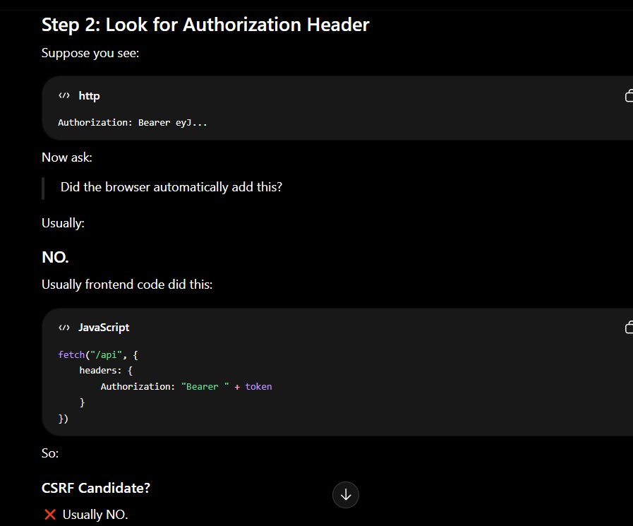
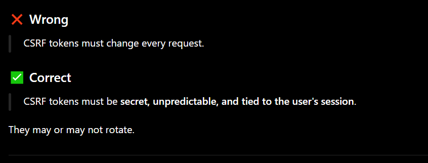

## is json safe

- html form se hum sirf application/x-www-form-urlencoded ye data bana skate h but agr application json data accept kare toh

- aur mainly json data hi karti h toh log application json ko dekte hi sochte h ye csrf se vulernable nahi 

- but ise check karna chaiye what if server check hi na kr raha ho data kispe a raha h like script hi na so is case me csrf ho jaega

## is jwt immune to csrf 

- jwt is immune to csrf only if it store in local storage agr woh cookies me store h toh vulebake nahi h kyuki

- local storage me frontedn call krket jwt token leta na ki har request ke sath browerser token attach kr deta h ye sirf cookeis m hota h

- so tum socho ge ki ise toh ek site bana ke duniya ek user ka sara jwt nikal skate h but ye hoga nahi 

- because of Same-Origin Policy (SOP)

- so same origin policy kehta h ki agr site ka ek khud ka storage hoga like apna ek locker room

- so bank ka jwt bank site hi access kare gi kyuki use pass sirf woh locker room hi na ki koi aur 

## How do I know if authentication is automatically sent by the browser?

## crsf token

## SameSite Cookies

- so sameSite cookies ki 3 value hoti h

- sameSite = none matlab koi bhi site me cookie add ho jaega like evil me se request victiom .com ko ja rahi h aur sameSite = none h to request m victim ki cookies attach ho jaegi

- sameSite = strict ko isme agar victim .com se nahi a rha h to simple attach anhi hogi cookie simple

- sameSite = lax ko isme get request ke sath toh cookies jaegi but post ke sath nahi toh get ke sath csrf ho skata h but post ke sath nahi simple

## Origin and Referer Validation

- so csrf protection can be used using the help of origin and refer validation

- so agr eveil ne form bana ke beja request and it contain evil.com or origin me victim .com nahi h to block aur request proced nahi krne dega

- refer bhi smae h but usme full url hota h

- but origin jada prefer hota h kyuki refer m data leaks ke chances hote h like token

- so orgin agr protrction h matlab ye nahi h ki bug nahi kyuki sometimes the developer check hi nahi karta proper

- ab tum schoge ki origin badal dege burp se kya pata chaelga use server ko but hum is form ko victim ke pass bejege uske browser ka access nahi h humare pass aur hum browser ko force nahi kr skate particular origin bejne ke liye simple

## important concept

- so agr developer same-site lex implent nahi karta toh browser apne aap use implement kar deta h

- but woh scriot anhi rehti so smae site site lex browser dalta h to usme ek conditon hoti h ki cookie milne ke 2 min baad tak tum post request bhi bej sakte ho but 2 min ke bad nahi 